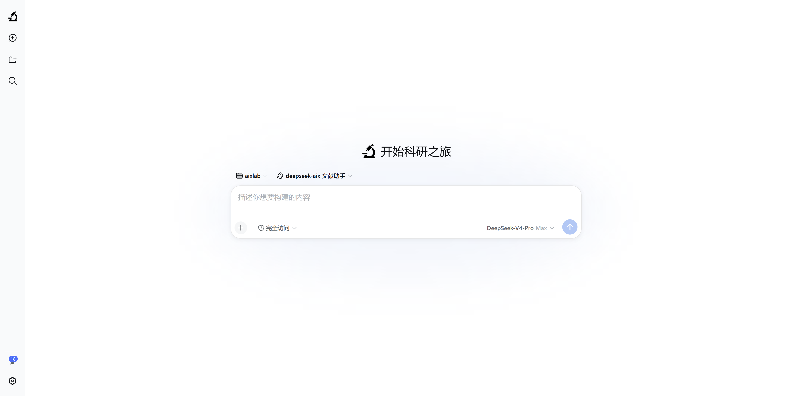
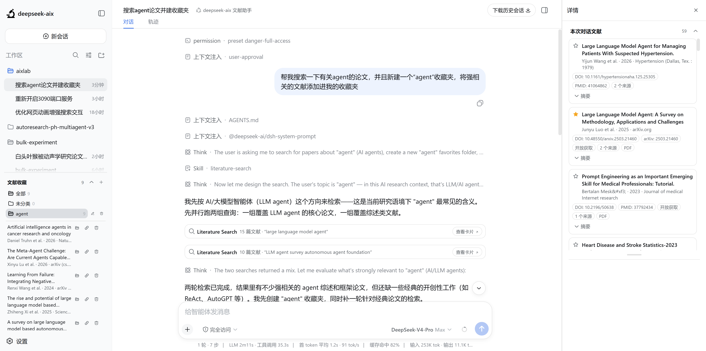

# deepseek-aix

[English](README.md) | 中文


**deepseek-aix** 是一个面向科学研究的 AI 文献助手：用对话描述研究主题，agent 通过内置的多源文献检索服务（PubMed、arXiv、Semantic Scholar、Crossref 等）帮你搜集相关文献，并把结果整理成可折叠、可收藏的文献卡片。

deepseek-aix 以 [DeepSeek Harness](https://github.com/deepseek-ai/deepseek-harness) 为底座 fork 而来：保留其完整的 agent 基础设施（会话、工具、子代理、工作流、Web GUI），并在此基础上新增文献能力 —— 多源文献检索服务、带分类文件夹的持久化收藏，以及把检索结果和收藏渲染为卡片的一等公民 Web UI。

## 产品亮点

- **对话式文献检索**：新建会话即默认进入 deepseek-aix 科研助手模式，用自然语言（中英文均可）描述研究主题，agent 会自动检索、去重、排序。
- **对话内论文卡片**：每次检索结果都渲染为卡片，包含作者、年份、期刊、摘要和 DOI/PMID/arXiv 标识。
- **带文件夹的收藏**：跨会话把论文收藏进持久的个人收藏夹，并在侧边栏中按分类文件夹管理。
- **一切皆插件**：底层框架采用插件化架构，由 [Cordis](https://github.com/cordiverse/cordis) 驱动，其设计参见论文 [_A Programming Paradigm for Spatiotemporal Composability_](https://github.com/cordiverse/paper)。

## 页面展示





## 模式与功能

| 功能 | 文献搜索模式 | 科研模式 |
|---|---|---|
| 对话式研究主题描述（中英文） | ✓ | ✓ |
| 多源文献检索（PubMed、Europe PMC、bioRxiv/medRxiv、Crossref、OpenAlex、Semantic Scholar、arXiv） | ✓ | — |
| 自动去重与多轮结果合并 | ✓ | — |
| 文献卡片（作者、年份、期刊、摘要、DOI/PMID/arXiv、开放获取标记） | ✓ | — |
| 收藏与分类文件夹（跨会话持久化） | ✓ | — |
| 全文获取（开放获取子集） | ✓ | — |
| 文献检索方法论技能 | ✓ | — |
| 工作区与文件管理 | ✓ | ✓ |
| 沙箱代码执行（bash / PowerShell） | ✓ | ✓ |
| 子代理与并行研究 | ✓ | ✓ |
| Goal 目标自动续跑 | ✓ | ✓ |
| 计划模式与任务拆解 | ✓ | ✓ |
| 持久会话、回放与多模型配置 | ✓ | ✓ |

## 开发者预览

deepseek-aix 目前处于 _开发者预览_ 阶段，正在快速迭代。**未来将出现破坏兼容性的变更。**

## 运行

### 通过 `npm` 运行

安装 `Node.js`，然后运行：

```sh
npx @deepseek-ai/dsh web --port 3090
```

该命令会启动 Web UI，地址为 `http://127.0.0.1:3090`（端口可配置，默认 `3080`）。详见 [Web UI 指南](docs/user/guide/index.md)。

### 从源码运行

如需从仓库源码运行：

```sh
git clone https://github.com/PHoenixs57/deepseek-aix.git
cd deepseek-aix
pnpm install
pnpm run build
pnpm dsh web
```

## 社区与支持

- 欢迎通过 [GitHub Discussions](https://github.com/PHoenixs57/deepseek-aix/discussions) 提交反馈或 bug 报告。
- 欢迎加入 DeepSeek Harness 企微群：扫码添加企微小助手并填写入群问卷，完成后小助手会邀请你入群。

## 参与贡献

参见 [CONTRIBUTING.md](CONTRIBUTING.md)。

## 开发

请先阅读[开发指南](docs/development.md)与[架构文档](docs/architecture.md)。

面向 agent：请遵循 [AGENTS.md](AGENTS.md)。

## 许可证

[MIT](LICENSE)

第三方依赖及其许可证见 [THIRD_PARTY_NOTICES.md](THIRD_PARTY_NOTICES.md)。
